```mermaid
flowchart LR
    %% ── Nodes ──────────────────────────────────────────────
    DATA(["data"])

    C1["chunking"]
    C2["chunking"]
    C3["chunking"]

    E1["embedding"]
    E2["embedding"]
    E3["embedding"]

    DB[("database")]

    USER(["user"])
    QE["embedding"]
    SS{{"similarity search"}}
    RR["Ranked result"]
    LLM{{"LLM"}}

    %% ── Indexing Flow ───────────────────────────────────────
    DATA --> C1 --> E1
    DATA --> C2 --> E2
    DATA --> C3 --> E3

    E1 --> DB
    E2 --> DB
    E3 --> DB

    %% ── Query & Retrieval Flow ──────────────────────────────
    USER -->|query| QE
    QE --> SS
    SS --> DB
    DB -->|top-K| RR

    %% ── Generation Flow ─────────────────────────────────────
    RR --> LLM
    LLM -->|answer| USER

    %% ── Styles ──────────────────────────────────────────────
    classDef dataStyle  fill:#1C1C1C,stroke:#BBBBBB,color:#FF4D6A,font-weight:bold
    classDef chunkStyle fill:#1C1C1C,stroke:#FF4D6A,color:#FF4D6A,font-weight:bold
    classDef embStyle   fill:#1C1C1C,stroke:#3DDC84,color:#3DDC84,font-weight:bold
    classDef dbStyle    fill:#1C1C1C,stroke:#4DA6FF,color:#E0E0E0,font-weight:bold
    classDef userStyle  fill:#6B3A00,stroke:#E8890C,color:#F0F0E8,font-weight:bold
    classDef qembStyle  fill:#1C1C1C,stroke:#E8890C,color:#E8890C,font-weight:bold
    classDef ssStyle    fill:#1C1C1C,stroke:#E8890C,color:#E8890C,font-weight:bold
    classDef rrStyle    fill:#1C1C1C,stroke:#FF6EB4,color:#FF6EB4,font-weight:bold
    classDef llmStyle   fill:#1C1C1C,stroke:#FF6EB4,color:#FF6EB4,font-weight:bold

    class DATA dataStyle
    class C1,C2,C3 chunkStyle
    class E1,E2,E3 embStyle
    class DB dbStyle
    class USER userStyle
    class QE qembStyle
    class SS ssStyle
    class RR rrStyle
    class LLM llmStyle
```

# RAG Architecture — Mermaid Diagram
### by Mayank Chugh | IT AI Enthusiast | @itaienthusiast

Paste the code block below into any Mermaid renderer:
- **mermaid.live** — https://mermaid.live
- **Notion** — paste in a code block, set language to `mermaid`
- **GitHub** — paste in any `.md` file inside triple backticks with `mermaid`
- **Medium** — use a code block embed tool

---

---

## Colour Reference (matches instructor's chalk palette)

| Element | Colour Code | Represents |
|---------|-------------|------------|
| data box border | `#BBBBBB` | Source data |
| chunking boxes | `#FF4D6A` | Red/pink — chunking step |
| embedding boxes (index) | `#3DDC84` | Green — embedding step |
| database diamond | `#4DA6FF` | Blue — vector store |
| user circle | `#E8890C` | Orange — user |
| embedding (query) | `#E8890C` | Orange — query encoding |
| similarity search | `#E8890C` | Orange — retrieval |
| Ranked result | `#FF6EB4` | Pink — ranked output |
| LLM | `#FF6EB4` | Pink — generation |
