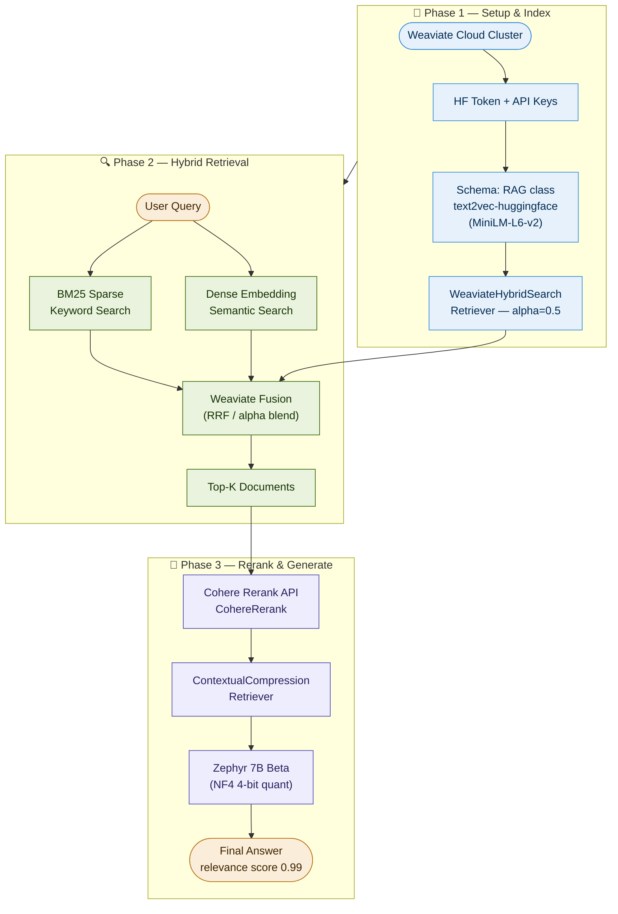

# Advanced RAG Ep 02 — Pipeline Architecture
### by Mayank Chugh | IT AI Enthusiast | @itaienthusiast

**Render at:** [mermaid.live](https://mermaid.live) | Notion | GitHub | Medium

---

---

## Colour Reference

| Phase | Colour | Represents |
|-------|--------|-----------|
| Phase 1 — Setup & Index | Blue (`#E6F1FB` / `#378ADD`) | Infrastructure & configuration |
| Phase 2 — Hybrid Retrieval | Green (`#EAF3DE` / `#3B6D11`) | Dual retrieval + fusion |
| Phase 3 — Rerank & Generate | Purple (`#EEEDFE` / `#534AB7`) | Reranking + LLM generation |
| Input / Output nodes | Amber (`#FAEEDA` / `#BA7517`) | User query + final answer |

---

## Key Design Decisions

- **Parallel branches in Phase 2** — BM25 and semantic search run simultaneously from the same user query, both feeding into Weaviate's RRF fusion step
- **Phase 1 feeds Phase 2 via `D → H`** — the WeaviateHybridSearchRetriever is the bridge between setup and retrieval
- **Reranker wraps the retriever** — `ContextualCompressionRetriever` sits between Cohere and Zephyr, acting as a quality filter before generation
- **Oval nodes** = external I/O (user query, final answer); **rectangle nodes** = internal processing steps

---

*Made with ❤️ by Mayank Chugh | GitHub: mayankchugh-learning | @itaienthusiast*
