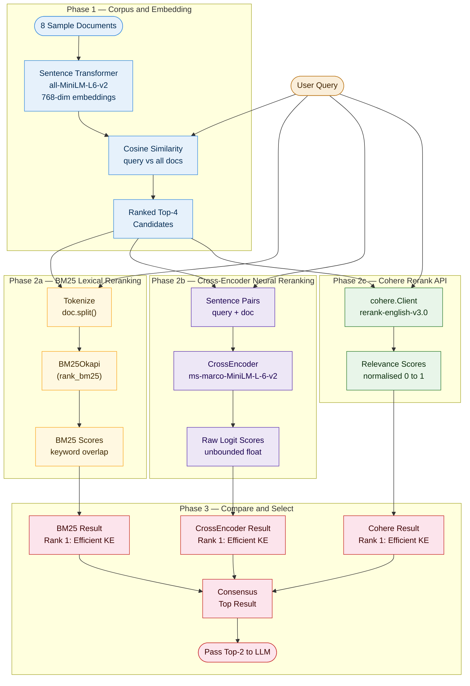

# Advanced RAG Ep 03 & 04 — Reranking Pipeline Architecture
### by Mayank Chugh | IT AI Enthusiast | @itaienthusiast

**Render at:** [mermaid.live](https://mermaid.live) | Notion | GitHub | Medium

---

---

## Colour Reference

| Phase | Colour | Represents |
|---|---|---|
| Phase 1 — Corpus and Embedding | Blue (`#E6F1FB` / `#378ADD`) | Bi-encoder retrieval and top-4 selection |
| Phase 2a — BM25 Lexical | Amber (`#FFF8E1` / `#F9A825`) | Keyword-based lexical reranking |
| Phase 2b — Cross-Encoder Neural | Purple (`#EDE7F6` / `#5E35B1`) | Neural pairwise reranking |
| Phase 2c — Cohere API | Green (`#E8F5E9` / `#2E7D32`) | API-based normalised reranking |
| Phase 3 — Compare and Select | Red (`#FCE4EC` / `#C62828`) | Consensus selection and LLM input |
| Input / Output nodes | Amber (`#FAEEDA` / `#BA7517`) | User query and final answer to LLM |

---

## Key Design Decisions

- **Single query, four parallel paths** — the user query drives the bi-encoder retrieval AND all three rerankers simultaneously, making the comparison fair (identical input, identical top-4 candidate set)
- **Top-4 gate** — Phase 1 bi-encoder selects the top-4 candidates from 8 documents; all rerankers in Phase 2 operate on this same filtered set, not the full corpus
- **Three independent rerankers in parallel** — BM25 (lexical, keyword tokens), Cross-Encoder (neural, pairwise), and Cohere (API, normalised score) each produce their own ranked output
- **Consensus selection in Phase 3** — rather than trusting any single reranker, the pipeline takes the document that appears at Rank-1 consistently across methods and passes only the top-2 consensus documents to the LLM
- **Score types differ by method** — BM25 gives unbounded positive floats (higher = more keyword overlap); Cross-Encoder gives raw logits (can be negative); Cohere gives normalised 0–1 scores. Do NOT compare absolute numbers across methods — only compare rankings
- **Oval nodes** = external I/O (user query, LLM input); **rectangle nodes** = internal processing steps

---

*Made with love by Mayank Chugh | GitHub: mayankchugh-learning | @itaienthusiast*
